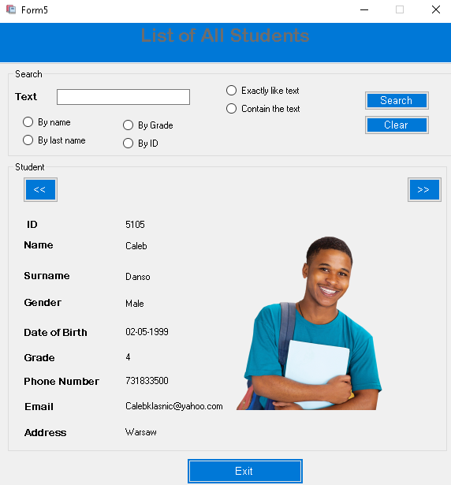

# Student Management System
The App was made using C# WinForm
A more complex program which allows user to add students, classes  and teachers. An option to read records from Teachers, Student and classes. This Idea was implemented 
with file and stream I/O.

------------------------------------------------------------------------------------------------

## About The App and Future Updates
- Connect with Database(MySql)
- Insert Update Delete  and Modify
- Add a login user for Student and Teachers
- filter option to search for student or teachers

------------------------------------------------------------------------------------------------

## Motivation
This is a big project that i have done with C# so far. i have worked with classes, inheritance multiple loops and try and catches to limit bugs in the program. if i was to  remake the project i will definetly make program using my sql database skills to make application more efficient and more organized code.

------------------------------------------------------------------------------------------------

## ScreenShots of Application
 
 
 
